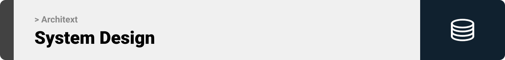

  

<!-- project overview -->

>Writing clean, maintainable code is no longer a manual effort - it's automated.
>
>Architext is your AI-powered architecture enforcer inside VS Code, helping you stick to your rules, your structure, and your standards.
>
>Forget the chaos of messy codebases. With Architext, your project architecture is no longer a guideline - it’s the default. 

  

<!-- System Design -->

### Add Title Here

- To be decided on later on.

  

<!-- Project Highlights -->

### Power of Architext

- Rule-Based Architecture Enforcement  
    Architext reads architectural rules from a default.arch.json or a custom *.arch.json file to validate your code and project structure.

- Folder Structure Validation  
    Checks your project’s folder layout against the defined architecture rules and shows a visual validation report.  
    `Ctrl + Alt + R`

- Code Style & Structure Validation  
    Validates the currently opened file (e.g., controller, service) against the architecture rules - from naming conventions to restricted imports and function styles.
     
    `Ctrl + Alt + A`

- Auto-Generate Function Comments
    Generate meaningful comments for all functions in a file or selected ones using AI.
     
    `Ctrl + Alt + C`

- Function Complexity Analyzer
    Instantly calculate and display the complexity of any function or file.
     
    `Ctrl + Alt + O`

- Documentation & Showcase Website

    - A feature-rich landing page

    - Full documentation

    - Live playground to test the extension

    - Config generator with AI assistance for creating your own .arch.json

  

<!-- Demo -->

### User Screens (Mobile)

| Login screen                            | Register screen                       | Register screen                       |
| --------------------------------------- | ------------------------------------- | ------------------------------------- |
|  |  |  |

### Admin Screens (Web)

| Login screen                            | Register screen                       |
| --------------------------------------- | ------------------------------------- |
|  |  |

  

<!-- Development & Testing -->

### Add Title Here

| Services                            | Validation                       | Testing                        |
| --------------------------------------- | ------------------------------------- | ------------------------------------- |
|  |  |  |

  

<!-- Deployment -->

### Add Title Here

- Description here.

| Postman API 1                            | Postman API 2                       | Postman API 3                        |
| --------------------------------------- | ------------------------------------- | ------------------------------------- |
|  |  |  |

  