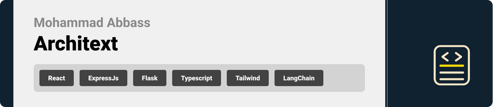

  

<!-- project overview -->

> This project is a modern, AI-powered toolkit designed to enhance code quality, enforce structural consistency, and align software with custom reference architectures. It includes a smart Visual Studio Code extension that analyzes code for naming and style consistency, generates descriptive comments, estimates time complexity (Big O notation), and even translates code across languages. The system is supported by a React-based documentation and demo website with a live compiler, and an Electron-powered admin dashboard that provides real-time analytics, user activity tracking, and usage insights. Together, these tools aim to streamline development workflows and bring intelligent automation into the coding process.

  

<!-- System Design -->

### Add Title Here

- To be decided on later on.

  

<!-- Project Highlights -->

### Add Title Here

- List the sexy features.

  

<!-- Demo -->

### User Screens (Mobile)

| Login screen                            | Register screen                       | Register screen                       |
| --------------------------------------- | ------------------------------------- | ------------------------------------- |
|  |  |  |

### Admin Screens (Web)

| Login screen                            | Register screen                       |
| --------------------------------------- | ------------------------------------- |
|  |  |

  

<!-- Development & Testing -->

### Add Title Here

| Services                            | Validation                       | Testing                        |
| --------------------------------------- | ------------------------------------- | ------------------------------------- |
|  |  |  |

  

<!-- Deployment -->

### Add Title Here

- Description here.

| Postman API 1                            | Postman API 2                       | Postman API 3                        |
| --------------------------------------- | ------------------------------------- | ------------------------------------- |
|  |  |  |

  